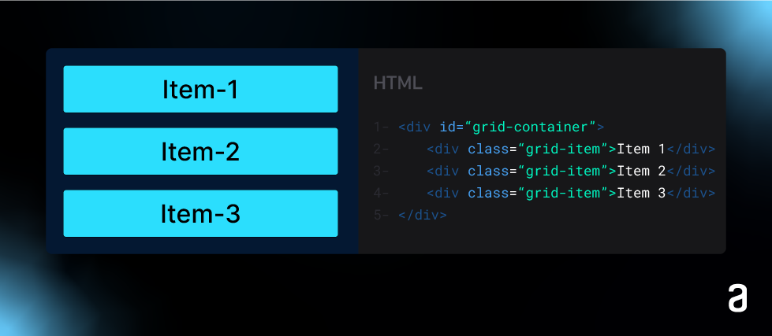
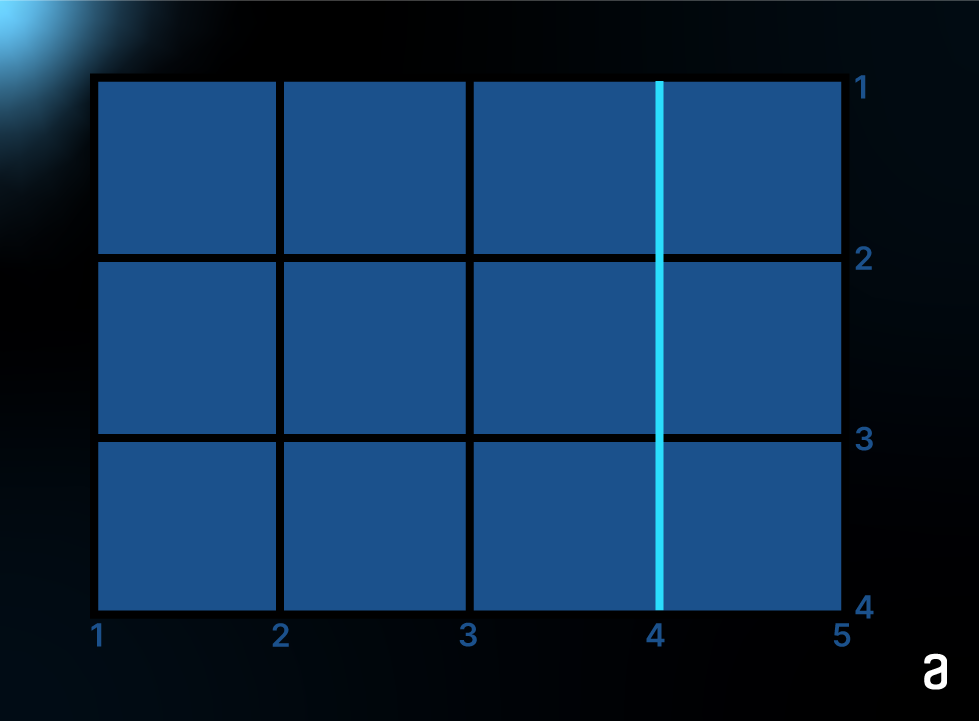
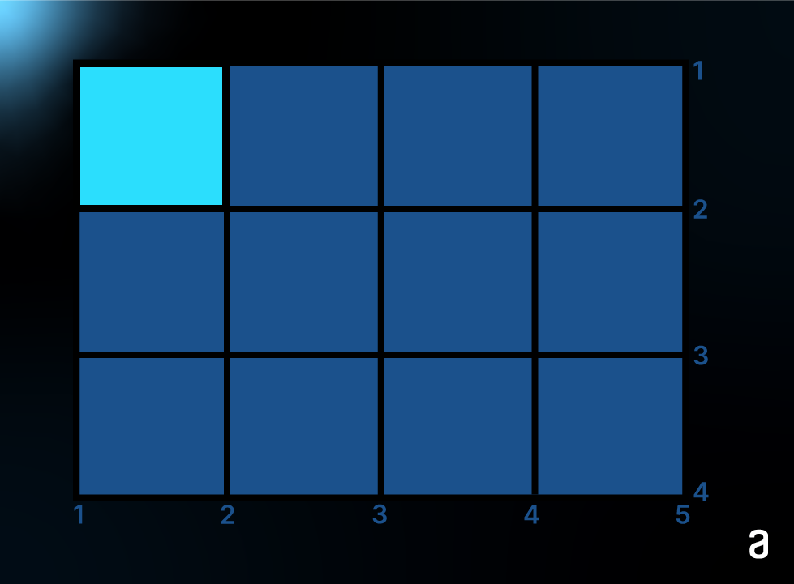
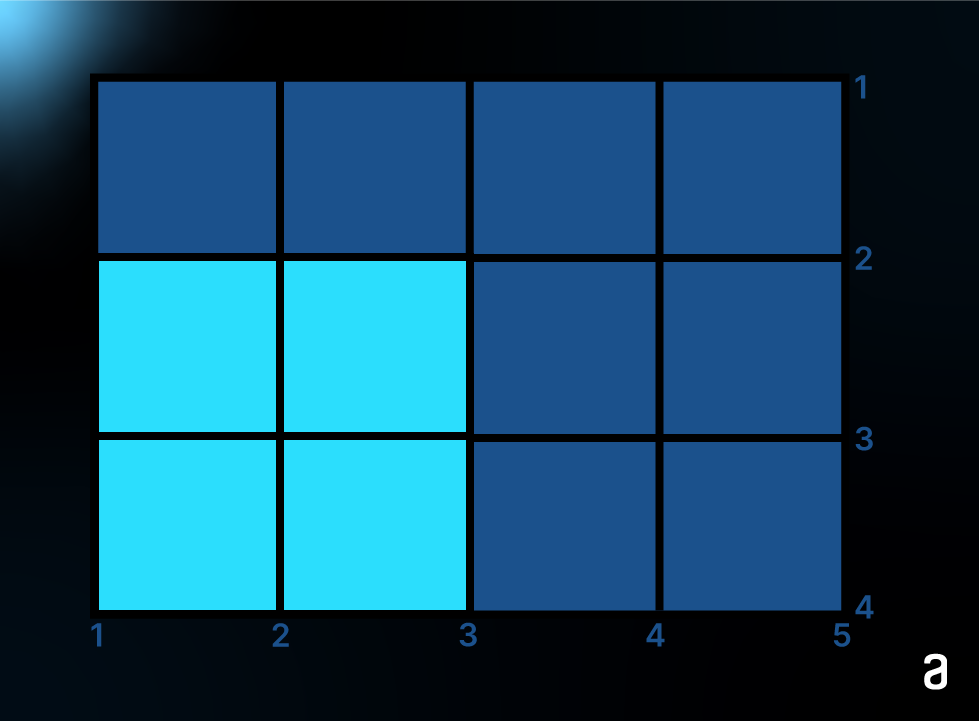
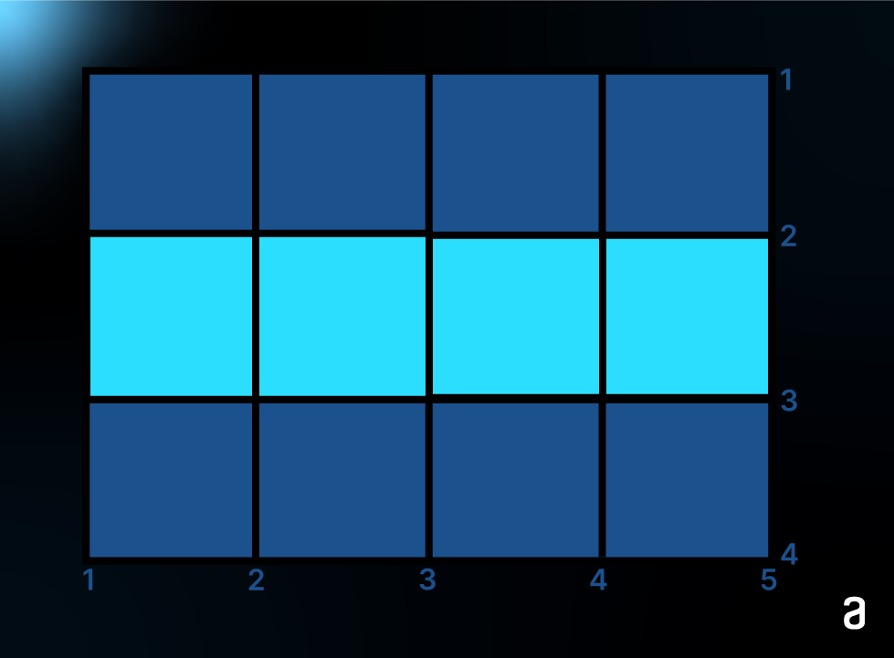

# Boas-vindas ao curso de **CSS: construindo layouts com Grid**

## Objetivo:
    Esta será uma jornada de muito aprendizado e prática, para dominarmos o Grid CSS. 
    Para isso, vamos posicionar todos os elementos do projeto WaveCast, que é uma página de Podcasts.

### [Figma do Projeto Wave Cast da Alura](https://www.figma.com/design/OkuJrConH0zKqaz6awMDvd/WaveCast-%7C-Curso-de-Grid?node-id=10701-312)

## Tamanhos de telas do Projeto Wave Cast

| Desktop    | Tablet      | Celular     |
|:-----------|:-----------:|------------:|
| 1400px     | 1024px      | 360px       |

## Artigos Alura:
### [Extensões VS Code: descubra quais são as mais usadas](https://www.alura.com.br/artigos/extensoes-vs-code-descubra-as-mais-usadas)
### [Criando Layouts com CSS Grid Layout](https://www.alura.com.br/artigos/criando-layouts-com-css-grid-layout)
### [CSS Grid: guia de propriedades de grid container e grid item](https://www.alura.com.br/artigos/css-grid-guia-propriedades-grid-container-grid-item)

## Artigos e links complementares:
### [CSS Grid Layout Module](https://www.w3schools.com/css/css_grid.asp)
### [Grid Garden](https://cssgridgarden.com/) >>> Site ideal para fixar o conteúdo sobre CSS Grid.


## Para saber mais: como o Grid funciona?
O CSS Grid, com sua flexibilidade e simplicidade, tornou-se uma escolha popular para o posicionamento de elementos em páginas da web. Como muitos termos no grid possuem nomes parecidos, aí vai um resumão sobre as principais terminologias do universo do Grid.

### Grid-container
O grid-container é um elemento HTML que funciona como o contêiner pai de todos os outros elementos envolvidos no layout do CSS Grid. Ao aplicar a propriedade ```display: grid``` a esse elemento, você sinaliza ao navegador que deseja criar um grid para organizar seus elementos internos.

### Grid Item
Um grid-item é um filho direto de um elemento que possui a propriedade ```display: grid``` aplicada a ele. Os grid-items são os elementos que podem ser posicionados e organizados dentro do grid. No exemplo abaixo, há um Grid Container com três Grid Items.

###### Fonte: Alura

### Grid Line (Linhas de grade)
Grid Lines são linhas invisíveis que dividem o grid em colunas e linhas. Elas podem ser horizontais (linhas de grade) ou verticais (colunas de grade). Grid Lines são numeradas a partir de 1, começando pela borda superior e esquerda do grid e aumentando em direção à borda inferior e direita. Você pode se referir a essas linhas usando números positivos (contagem crescente a partir do início) ou números negativos (contagem regressiva a partir do final). No exemplo abaixo está destacado a linha/traço 4 vertical.

###### Fonte: Alura

### Grid Cell
Um Grid Cell é o espaço delimitado por quatro Grid Lines adjacentes: duas verticais e duas horizontais. Em outras palavras, é um retângulo formado pela interseção de duas colunas de grade e duas linhas de grade adjacentes. Cada célula é uma unidade individual dentro do grid e pode conter um ou mais Grid Items. No exemplo, está destacado a célula que o ocupa do traço 1 até o traço 2 horizontalmente e do traço 1 até o 2 verticalmente.

###### Fonte: Alura

### Grid Area
Um Grid Area é um espaço retangular maior no grid que pode conter múltiplas Grid Cells. É definida pela especificação de um retângulo no grid, limitado por quatro Grid Lines. Grid Areas são frequentemente usadas para agrupar vários Grid Items e facilitar o posicionamento conjunto. Você pode nomear as áreas do grid para referenciar facilmente em seu CSS. Abaixo a grid área, ocupa o traço 1 até o 3 horizontalmente e o traço 2 e 4 verticalmente.

###### Fonte: Alura

### Grid Track
Um Grid Track é uma coluna ou linha individual dentro do grid. Eles são criados automaticamente quando você define as colunas e linhas usando propriedades como grid-template-columns e grid-template-rows. Cada Grid Track possui uma largura ou altura específica, que pode ser definida de várias maneiras, como pixels, porcentagem ou frações (como 1fr, que divide o espaço disponível igualmente). No exemplo, a grid track ocupa da grid line 2 até a grid line 3 horizontalmente.

###### Fonte: Alura 


Entender os conceitos de Grid Container, Grid Item, Grid Line, Grid Cell, Grid Area e Grid Track é fundamental para aproveitar ao máximo todas as possibilidades do CSS Grid em seus projetos.